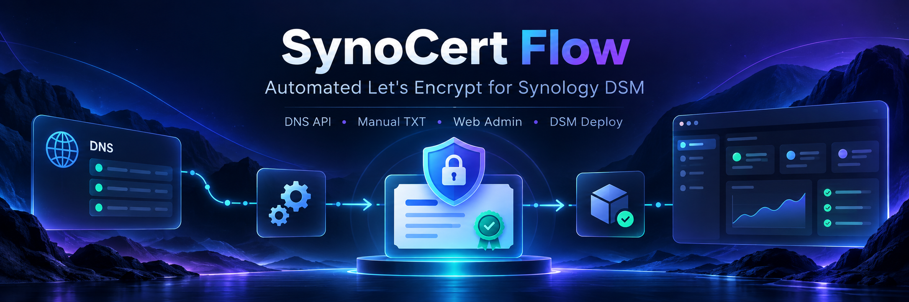

<div align="center">



# 🔐 SynoCert Flow

### Премиальная автоматизация Let's Encrypt для Synology DSM

**DNS API · Manual TXT · Web Admin · DSM Deploy · Telegram Control**


</div>

---

**SynoCert Flow** — это лёгкий self-hosted проект для выпуска, продления и автоматического деплоя wildcard-сертификатов **Let's Encrypt** в **Synology DSM**.

Проект построен на **acme.sh + POSIX Shell + Docker Compose**, а в версии **v1.7.0** дополнен полноценной **Web Admin** панелью с Dashboard, Add/Edit Domain, DNS Accounts, Backup / Restore и System Health.

> 🚀 **Как это работает:** SynoCert Flow создаёт DNS challenge через API регистратора **или** ждёт ручной TXT, проверяет её появление, выдерживает окно стабилизации **600 секунд**, выпускает сертификат и **сам деплоит его в Synology DSM**.

```text
DNS API / Manual TXT → TXT verification → 600s stabilization → Let's Encrypt → Synology DSM deploy
```

## ✨ Что умеет

- 🔄 **Автопродление** сертификатов без ручных команд;
- 🌍 **DNS API** для REG.RU и Spaceship из коробки;
- 📝 **Manual DNS-01** для случаев без API;
- 🔐 **DSM Deploy** — автоматическая установка сертификата в Synology DSM;
- 🧩 **Multi-domain** — несколько доменов, несколько DSM-пользователей, несколько ACME accounts;
- 🖥 **Web Admin** на `:8332` с Dashboard, Domain, Add/Edit Domain и Settings;
- 🤖 **Telegram Control** — команды, уведомления и одноразовый вход в Web Admin;
- 📜 **Activity timeline** и расширенный **System Health**;
- 💾 **Backup / Restore** конфигурации из админки;
- 🛡 **Безопасная очередь команд** — Web, Telegram и scheduler не конфликтуют между собой.

## 🖥 Web Admin

После запуска проекта панель доступна по адресу:

```text
http://NAS-IP:8332
```

Вход по умолчанию — через Telegram OTP:

```text
/web-login
```

В панели доступны:

- **Dashboard** — все домены, статусы, сертификаты, queue, next action;
- **Domain** — Test / Renew / Force Renew / Deploy / Debug, TXT challenge, readiness;
- **Add Domain** — мастер добавления домена через DNS API или Manual TXT;
- **Edit Domain** — изменение DSM, DNS account, ACME account, SAN и параметров deploy;
- **Settings** — DNS accounts, Telegram, health, backups, restore.

> Web Admin **не управляет Docker напрямую** и не требует `docker.sock`. Все действия отправляются в общую queue, а выполнять ACME/DNS/DSM операции может только один worker.

## 🚀 Быстрый старт

### 1) Распакуйте проект

Например:

```text
/volume1/docker/synocert-flow
```

### 2) Создайте `.env`

```bash
cp .env.example .env
```

Минимум, что нужно заполнить:

```env
TELEGRAM_BOT_TOKEN=''
TELEGRAM_CHAT_ID=''
WEB_PORT=8332
```

### 3) Создайте Project в Synology Container Manager

```text
Container Manager → Проект → Создать
```

Параметры:

```text
Имя проекта: synocert-flow
Путь: /volume1/docker/synocert-flow
Источник: compose.yaml
```

После запуска должны появиться сервисы:

```text
acme-synology
acme-telegram
synocert-web
```

### 4) Откройте Web Admin

```text
http://NAS-IP:8332
```

### 5) Войдите через Telegram

Отправьте боту:

```text
/web-login
```

Введите полученный одноразовый код в Web Admin.

### 6) Добавьте первый домен

Через **Add Domain** укажите:

- домен;
- DNS provider / manual mode;
- DNS account или credentials;
- DSM host / user / password;
- имя сертификата в DSM.

Дальше SynoCert Flow сам выполнит:

```text
Save config → Preflight Test → DNS / TXT verification → Issue / Renew → DSM Deploy
```

## 🌐 DNS providers

Поддерживаются два основных сценария:

### REG.RU

В настройках или в `config/dns-providers.d/regru-main.env`:

```env
DNS_API='dns_regru'
REGRU_API_Username='LOGIN'
REGRU_API_Password='PASSWORD'
```

### Spaceship

В настройках или в `config/dns-providers.d/spaceship-main.env`:

```env
DNS_API='dns_spaceship'
SPACESHIP_API_KEY='API_KEY'
SPACESHIP_API_SECRET='API_SECRET'
SPACESHIP_ROOT_DOMAIN=''
```

Если DNS API не указан, проект автоматически работает через **Manual TXT**.

## 🤖 Telegram команды

```text
/help
/status
/domains
/health
/web-login
/test <domain>
/renew <domain>
/renew-force <domain>
/deploy <domain>
/debug <domain>
```

## 🛡 Безопасность

- Web / Telegram / scheduler используют **общую очередь команд**;
- только **Certificate Worker** взаимодействует с `acme.sh`, DNS и DSM;
- Web-сессии: **HttpOnly + SameSite=Strict + CSRF**;
- поддержан **Telegram OTP login**;
- секреты DNS / DSM **не отображаются обратно** в UI;
- проект не требует доступа к `docker.sock`.

## 📁 Основная структура

```text
synocert-flow/
├── app/                 # shell workers
├── config/
│   ├── domains.d/       # домены
│   └── dns-providers.d/ # DNS accounts
├── data/                # acme.sh storage
├── state/               # queue, runtime state, OTP, health
├── logs/
├── backups/
├── web/                 # Web Admin
├── docs/
│   └── github-banner.png
├── compose.yaml
└── .env
```

## 📌 Важно

- Не публикуйте реальные `.env`, DNS credentials, `data/`, private keys и backup-файлы в Git.
- Для внешнего доступа к Web Admin используйте **VPN** или **HTTPS reverse proxy**.
- При изменении DNS API / DSM настроек текущий сертификат остаётся валидным; новые параметры применяются при следующем test / renew / deploy.

## 📄 Документация

Дополнительные файлы в архиве:

- `WEB-ADMIN.md` — подробности по Web Admin;
- `CHANGELOG.md` — история изменений;
- `DESIGN.md` / `REDESIGN-RU.md` — UI/UX описание;
- `HOTFIX-1.6.1.md` — заметки по hotfix.

---

<div align="center">

### SynoCert Flow

**Set it once. Let certificates renew themselves.**

</div>
